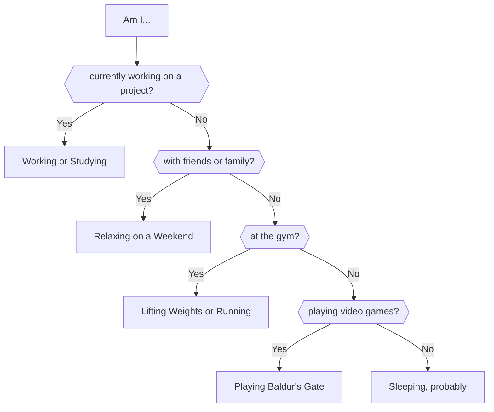

### Hi I'm James 
I'm a Software Engineer @ Canon and former SDET for Endeavor. Currently I'm working with a lot of Node, TypeScript & Python, as well as learning go.

- 🔭 I’m currently working on a system for making tabletop RPG rulesets
- 🌱 I’m currently learning Golang

### What I'm likely doing right now

<!--
**jamescastro98/jamescastro98** is a ✨ _special_ ✨ repository because its `README.md` (this file) appears on your GitHub profile.

Here are some ideas to get you started:

- 🔭 I’m currently working on ...
- 🌱 I’m currently learning ...
- 👯 I’m looking to collaborate on ...
- 🤔 I’m looking for help with ...
- 💬 Ask me about ...
- 📫 How to reach me: ...
- 😄 Pronouns: ...
- ⚡ Fun fact: ...
-->
